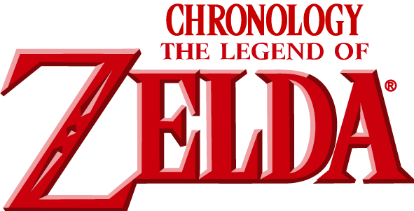

  

  

# Legend of Zelda Timeline

Aplicación en JavaScript que transforma un JSON con eventos en una línea temporal visual del legendario juego de Zelda.   

## Descripción

● Se nos proporciona una API (https://gist.github.com/bertez/8e62741154903c35edb3bfb825a7f052) en formato JSON que contiene un array de objetos que representan eventos desordenados en el tiempo.  

● La aplicación procesa estos eventos y los ordena en el tiempo. 

● Usando los métodos de DOM se introducen en el HTML cada uno de estos eventos que representan todos los datos recibidos por el JSON:
año, título, imágen y texto. 

● El timeline representado será horizontal para poder hacer clic en cada linea temporal y poder mostrar todos los datos correspondentes a ese año. 

● La aplicación mostrará un formulario con los campos (año, título, url de la imagen y texto) para introducir dinámicamente un nuevo evento en la línea temporal después de que los elementos del JSON ya estén representados.    

## Recursos
● Lista de eventos  

● document.createElement  

● Element.innerHTML    

## Tecnologías empleadas

